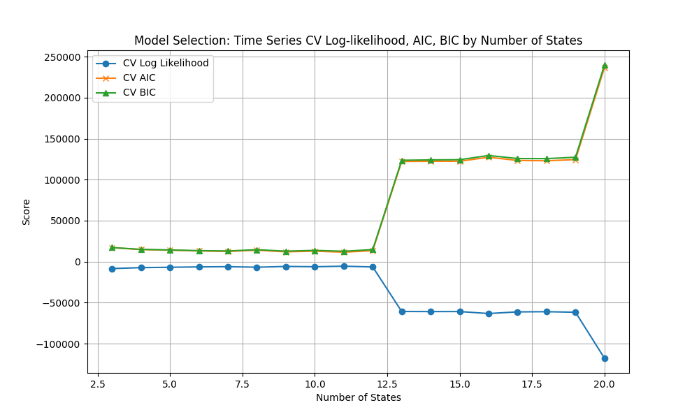
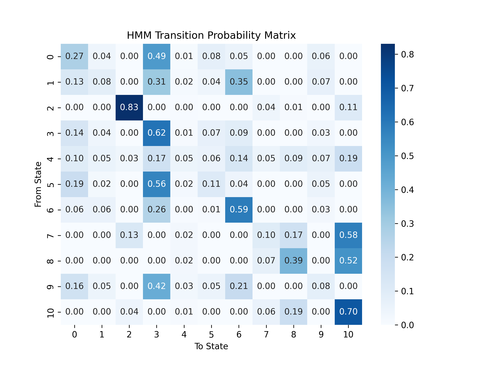
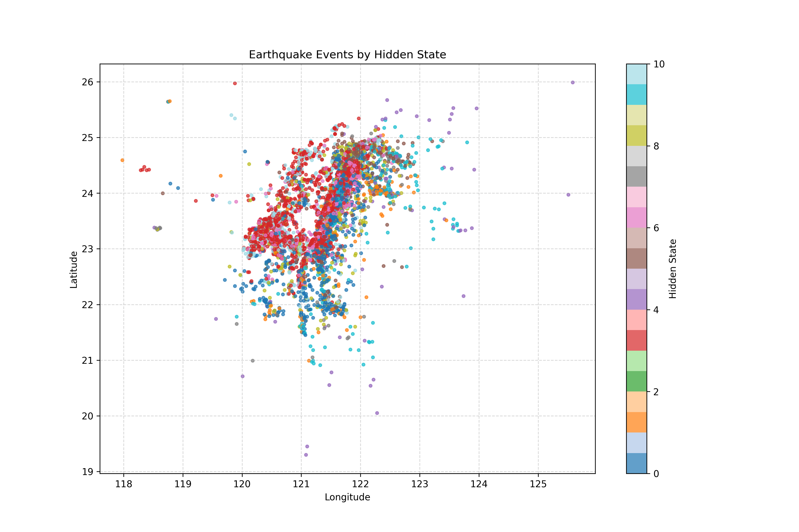
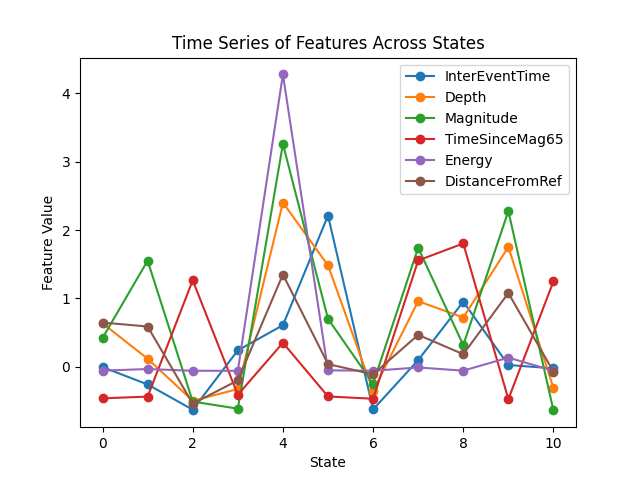

# Best model chosen 

## Relevant figures and diagrams 

```
Confusion Matrix:
[[  0   0   0   0   0   0   0   0   0   0   0]
 [  9  21   1   0   0 153   1   0 159   0  29]
 [  5   0   3   0   0  90   0  31  14  98   0]
 [ 40   0   0 122   0 366  17   0 171   0 489]
 [ 18   0   0   0  35   0   0   0   0   0   0]
 [ 68   0   0   0   0 113   0  11  51   2   0]
 [  4   1   0   3   0  40 233   0  42   0 223]
 [  3   0   0   0   0   0   0  21   0   0   0]
 [ 21   0   0   0   0   0   0   2  53   0   0]
 [  5   0   0   0  16   0   0   5   0 100   0]
 [  9   0   0   0   0   0   0   0  20   0 115]]


Weighted Average Classification Report:
{'precision': 0.7879553180628392, 'recall': 0.26904055390702275, 'f1-score': 0.26753124523384547, 'support': 3033.0}

```

best model chosen metrics:
- Best model selected: 11 states 
- log likelihood: 3112.134422166114, 
- aic: -5186.268844332228, 
- bic: -2039.8662255005493

With the plots, we can see that after state 11, the states were not converging:



We can see that the matrix is quite sparse:



The model becomes a bit hard to interpret when looking geographically:


So, looking at the features we get:



## Analysis

### Transition matrix 
- Diagonal dominance in transition matrix: Strong self-transition probabilities suggest states tend to persist, indicating earthquake activity has temporal clustering or "stickiness"
  - the aftershocks
- Limited State Connectivity: Most states only transition to 2-3 other states, suggesting distinct seismic regimes with restricted pathways between them
- Potential Absorbing States: Some states may act as temporary "attractors" in the seismic cycle?
  - Like state 10

### Geographic interpretation 

- There is a lot of spatial mixing,
 - could be that states are more clustered due to temporal or magnitude based events rather than graphically (not clustered near fault line)
   - maybe state 6 could be related with severe earthquake 
 - more symptomatic of the univariate distribution with counts and no other features 
- Different earthquake "phases" or "regimes" can occur across the entire study region

### Feature state relation

The following is my interpretation from reading about how earthquakes work and trying to interpret the graph, use it as reference with caution ⚠️

#### **States 3-6: Moderate Severe Earthquake Phase**
- **Magnitude**: Elevated magnitude levels (4.5-5.5 range)
- **Inter-event Time**: Moderate to high inter-event times, suggesting these occur during building stress phases
- **Depth**: Mixed depth distribution, indicating both shallow and deeper moderate events
- **Time Since Mag 6.5**: Moderate values, representing intermediate phases in seismic cycles
- **Energy**: Elevated energy release corresponding to moderate-severe events
- **Distance from Reference**: Distributed across various distances from reference point

**Seismic Interpretation**: These states capture the transitional phase between background seismicity and major events - likely representing foreshock sequences, moderate mainshocks, or stress redistribution following major earthquakes.

### **States 8-10: Major Earthquake/Immediate Aftermath Phase**
- **Magnitude**: Highest magnitude values (5.5+ range), representing major seismic events
- **Inter-event Time**: Very low values, indicating rapid succession of events (classic aftershock pattern)
- **Depth**: Relatively shallow depths, making these events particularly hazardous
- **Time Since Mag 6.5/5**: Very low values, confirming these states occur immediately following or during major earthquake sequences
- **Energy**: Peak energy release values, representing maximum seismic energy discharge
- **Distance from Reference**: Concentrated patterns suggesting spatial clustering of major events

**Seismic Interpretation**: These states represent the most critical seismic phases - major mainshocks (State 10) and their immediate aftershock sequences (States 8-9), characterized by high magnitude, shallow depth, and temporal clustering. 


