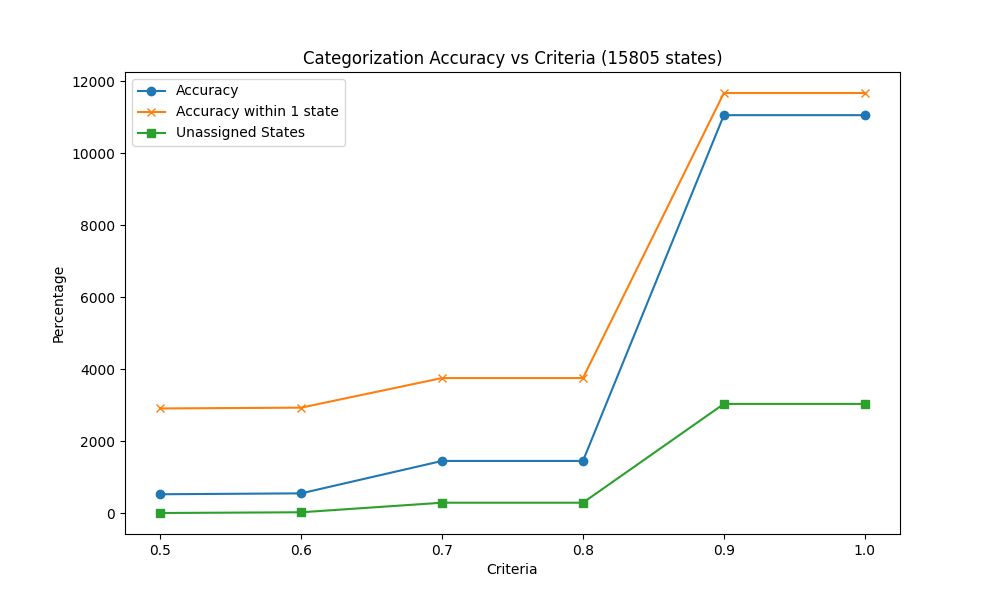
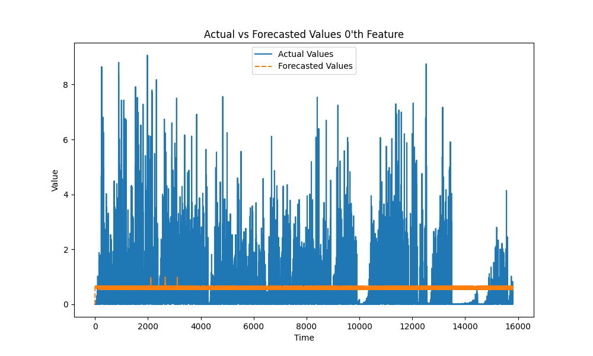
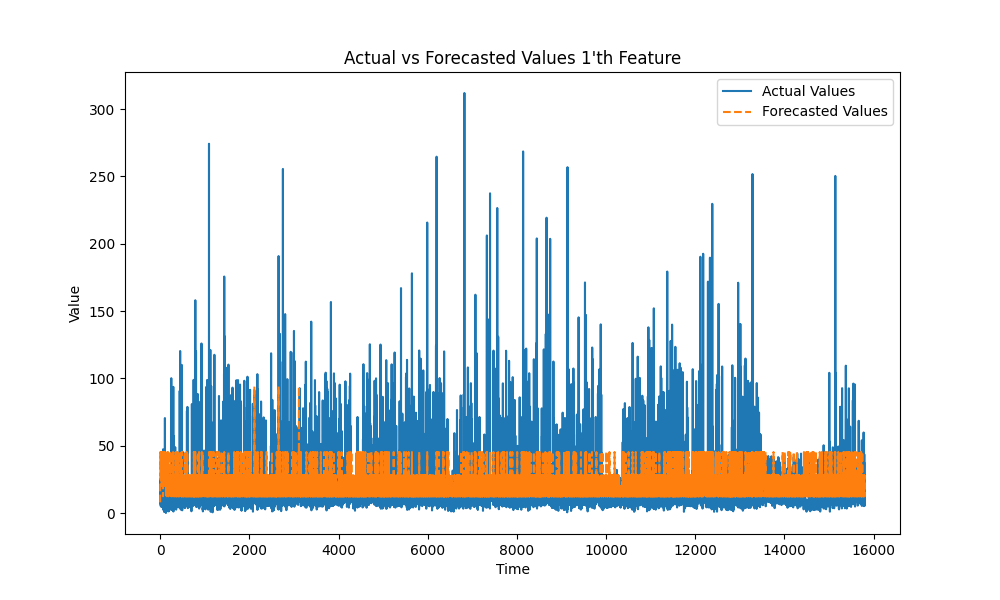
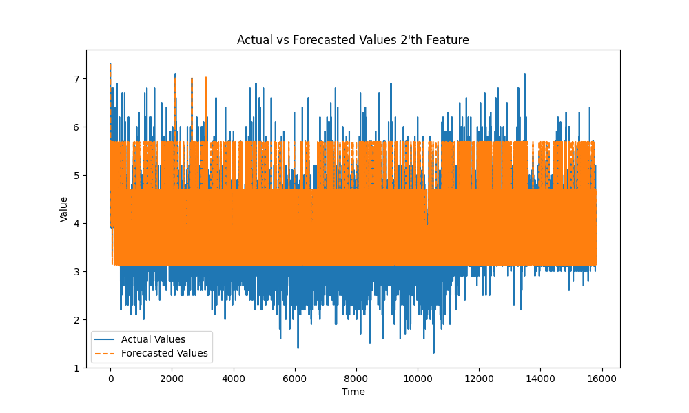
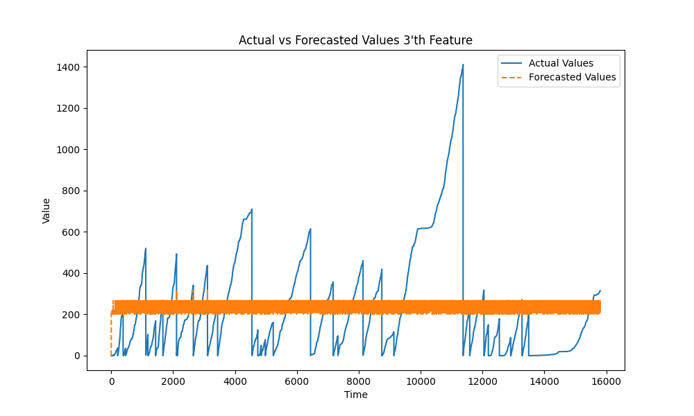
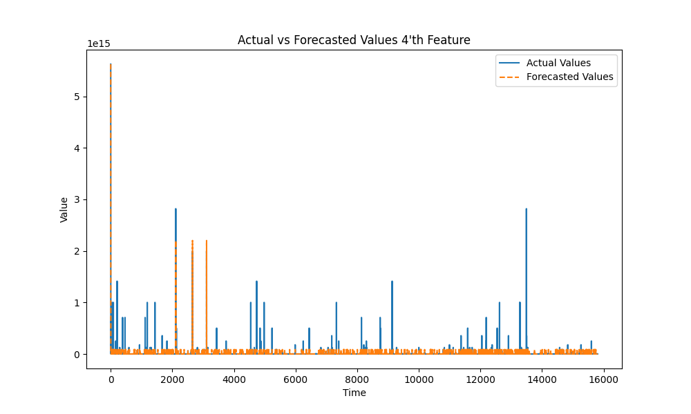
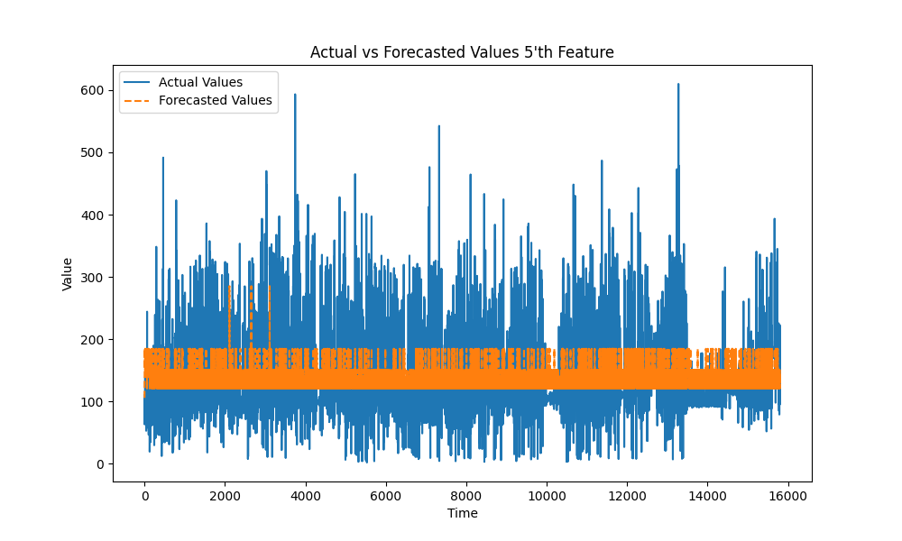

# With Scaling

Checking the features:
```
MSE: 8.843453455171626e+26
```

The matches were doing by categorizing the states based on the $\bar{x}\pm  2 \cdot sd(x)$ for each feature

The ideal accuracy is by setting thresholds with higher $sd$ and allowing it to meet higher criteria (ideally all)

The time stamps were categorised and the the forecasted values were compared against it \[best so far]

```
Matched states : 3785;   Accuracy: 23.95%
Matched within 1 state: 3940;    Accuracy within 1 state: 24.93%
```

# W/out scaling


Checking with features:
```
Mean Squared Error: 3.0550680492414715e+26
```

The matches were doing by categorizing the states based on the $\bar{x}\pm  2 \cdot sd(x)$ for each feature

The ideal accuracy is by setting thresholds with higher $sd$ and allowing it to meet higher criteria (ideally all)

The time stamps were categorised and the the forecasted values were compared against it \[best so far]
```
Total number of states: 15805
Matched states : 11059; 	    Accuracy: 69.97%
Matched within 1 state: 11675; 	Accuracy within 1 state: 73.87%
unassigned : 3033,              Percentage : 19.19% 
```

The graph of the different features:








[statsexchange_link](https://stats.stackexchange.com/questions/296976/methods-to-validate-a-hidden-markov-model)